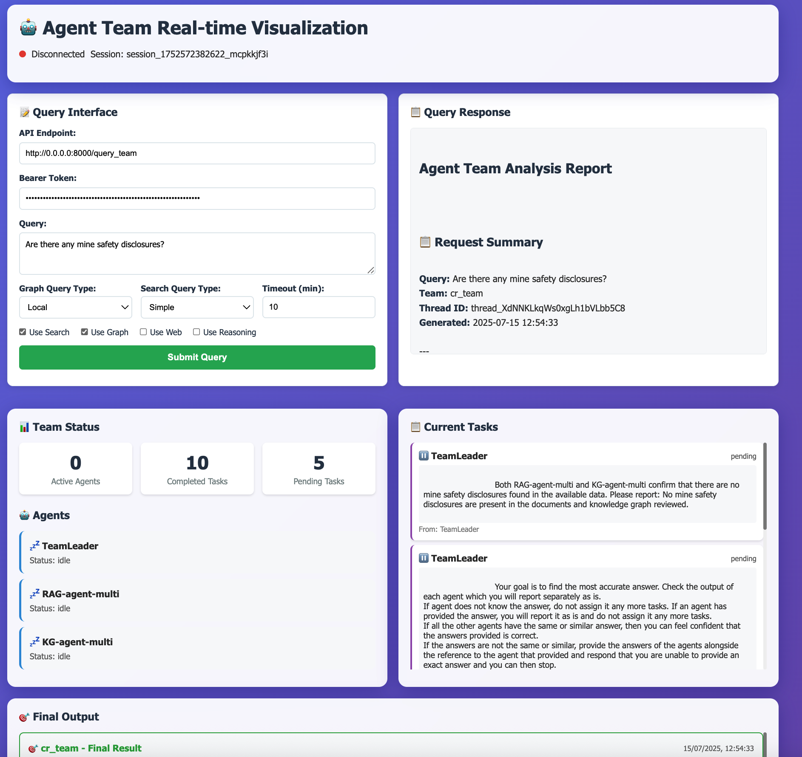
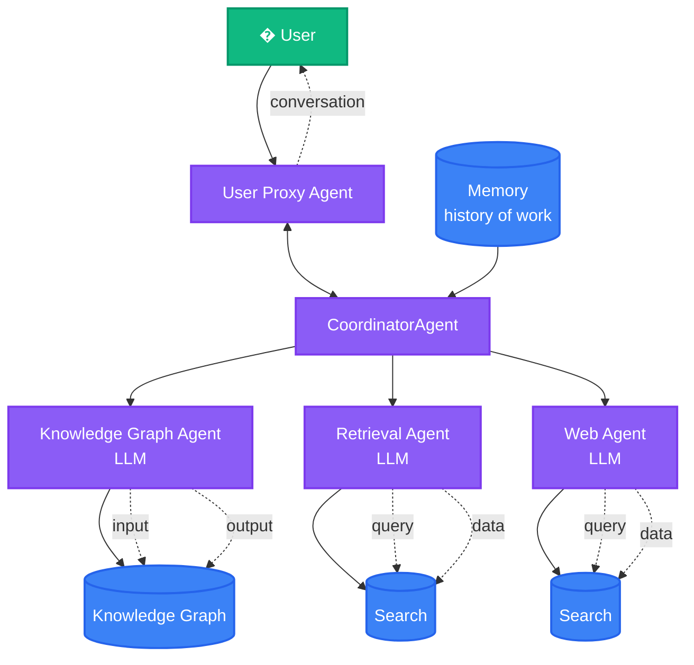

# GraphRAG Multi-Agent Financial Analysis System

👉 [Use the GraphRAG Accelerator solution](https://github.com/Azure-Samples/graphrag-accelerator) <br/>
👉 [Microsoft Research Blog Post](https://www.microsoft.com/en-us/research/blog/graphrag-unlocking-llm-discovery-on-narrative-private-data/)<br/>
👉 [Read the docs](https://microsoft.github.io/graphrag)<br/>
👉 [GraphRAG Arxiv](https://arxiv.org/pdf/2404.16130)

<div align="left">
  <a href="https://pypi.org/project/graphrag/">
    
  </a>
  <a href="https://pypi.org/project/graphrag/">
    
  </a>
  <a href="https://github.com/microsoft/graphrag/issues">
    
  </a>
  <a href="https://github.com/microsoft/graphrag/discussions">
    
  </a>
</div>

## Overview

This repository demonstrates a **Multi-Agent Financial Analysis System** that leverages GraphRAG as one of its core agent tools. The system combines multiple specialized AI agents to provide comprehensive financial analysis capabilities:

- **GraphRAG Agent (KG-agent)**: Uses knowledge graphs for precise financial data extraction
- **Document Search Agent (RAG-agent)**: Searches indexed financial documents using Azure AI Search
- **Web Search Agent (Bing-agent)**: Retrieves external market data and financial news
- **Team Leader Agent**: Orchestrates tasks between specialized agents

The GraphRAG component is a data pipeline and transformation suite that extracts meaningful, structured data from unstructured text using the power of LLMs.

To learn more about GraphRAG and how it can be used to enhance your LLM's ability to reason about your private data, please visit the <a href="https://www.microsoft.com/en-us/research/blog/graphrag-unlocking-llm-discovery-on-narrative-private-data/" target="_blank">Microsoft Research Blog Post.</a>

## 🚀 Quick Start - Multi-Agent System

### Prerequisites

- Azure AI Projects subscription
- Azure AI Agents enabled
- Azure OpenAI API access
- Docker (for containerized deployment)

For a more detailed guide for setting up the necessary Azure services, see [AZURE_SETUP_GUIDE.md](./AZURE_SETUP_GUIDE.md)

### 1. Setup Environment Variables and login
Login via Azure CLI:
```
az login
```


Copy the environment template and populate with your Azure credentials:

```bash
cd app
cp env_sample .env
```

Edit `.env` file with your Azure credentials:

```bash
# Required - Azure OpenAI Configuration
AZURE_OPENAI_API_KEY=your_azure_openai_api_key_here
PROJECT_ENDPOINT=https://your-project.services.ai.azure.com/api/projects/your-project/
AZURE_OPENAI_ENDPOINT=https://your-resource.cognitiveservices.azure.com/

# Optional - Application Insights (for telemetry)
APPLICATIONINSIGHTS_CONNECTION_STRING=your_connection_string_here

# Optional - Model Configurations (defaults provided)
MODEL_DEPLOYMENT_NAME=gpt-4.1
REASONING_MODEL_DEPLOYMENT_NAME=o3-mini  # Used for complex analytical reasoning when use_reasoning=true
AI_SEARCH_TYPE=SIMPLE
GRAPH_QUERY_TYPE=local
AI_SEARCH_INDEX_NAME=your_search_index_name

# Optional - Data Paths (adjust for your environment)
RAW_INPUT_PATH=/path/to/your/raw/data
OUTPUT_PATH=/path/to/your/processed/data
GRAPH_OUTPUT_PATH=/path/to/your/graph/output
INPUT_DIR=./data/output
```

### 2. Prepare GraphRAG Data

Before running the multi-agent system, you need to index your documents using GraphRAG:

```bash
# Install GraphRAG - NOT REQUIRED IF USING DEVCONTAINER
pip install graphrag


# Initialize GraphRAG configuration and  Index your documents (this creates the knowledge graph)
./app/re-index-graphrag.sh
```

Once this is done, you can test that this has worked by issuing a query to Graphrag:
```bash
graphrag query --root ./data --method global -q "{your-query}"
```

Place the generated GraphRAG output files in the `data/output/` directory (or update `INPUT_DIR` in your `.env`).

### 3. Run with Docker

```bash
# Build the container
docker build -t graphrag-agents .

# Apple silicon
docker buildx build --platform linux/amd64 -t graphrag-agents .

# Run the container
docker run -p 8000:8000 --env-file .env graphrag-agents
```

### 4. Run Locally

```bash
# Install dependencies
pip install -r requirements.txt

# Start the FastAPI application
uvicorn main:app --host 0.0.0.0 --port 8000
```

### 5. Access the API

- **API Documentation**: http://localhost:8000/docs
- **Health Check**: http://localhost:8000/health
- **Query Endpoint**: POST http://localhost:8000/query_team
- **Real-time Dashboard**: http://localhost:8000/dashboard

#### Example API Request

```bash
curl -X POST "http://localhost:8000/query_team" \
  -H "Content-Type: application/json" \
  -d '{
    "query": "What were the revenue trends for Q4?",
    "graph_query_type": "global",
    "search_query_type": "SEMANTIC",
    "use_search": true,
    "use_graph": true,
    "use_web": false,
    "use_reasoning": false,
    "evaluation_mode": false
  }'
```

## 📊 Real-time Dashboard

Monitor your agent team collaboration in real-time with the interactive dashboard:



### Dashboard Features

- **Live Agent Status**: See which agents are active, working, or idle
- **Task Flow Visualization**: Track tasks as they move through the team
- **Activity Timeline**: Real-time log of all agent activities
- **Performance Metrics**: Live counters for active agents and completed tasks
- **WebSocket Integration**: Instant updates without refreshing

### Access the Dashboard

1. Start your application: `uvicorn main:app --host 0.0.0.0 --port 8000`
2. Open your browser to: http://localhost:8000/dashboard
3. Send API requests to see real-time updates

For detailed dashboard documentation, see [UI/REALTIME_VISUALIZATION.md](./UI/REALTIME_VISUALIZATION.md)

## 🔗 API Usage

The multi-agent system exposes a REST API for querying financial data. Once running, you can interact with it using the following endpoints:

### Main Query Endpoint

**POST** `/query_team`

Send financial queries to the agent team. The system will automatically route your query to the most appropriate agent(s).

#### Request Body

```json
{
  "query": "What were the revenue trends for Q4 2024?",
  "graph_query_type": "global",
  "search_query_type": "SEMANTIC",
  "use_search": true,
  "use_graph": true,
  "use_web": false,
  "use_reasoning": false
}
```

#### Parameters

- `query` (required): Your financial question or analysis request
- `graph_query_type`: GraphRAG query method (`global`, `local`, `drift`, `basic`)
- `search_query_type`: Document search type (`SIMPLE`, `SEMANTIC`)
- `use_search`: Enable Azure AI Search for document retrieval (default: `true`)
- `use_graph`: Enable GraphRAG knowledge graph queries (default: `true`)
- `use_web`: Enable Bing Search for external data (default: `false`)
- `use_reasoning`: Enable reasoning capabilities for complex queries (default: `false`)
- `evaluation_mode`: Disable WebSocket updates for evaluation/testing (default: `false`)

#### Response

```json
{
  "response": "Formatted markdown response with analysis results",
  "query": "What were the revenue trends for Q4 2024?"
}
```

### Other Endpoints

- **GET** `/`: API information and available endpoints
- **GET** `/health`: Health check endpoint
- **GET** `/docs`: Interactive API documentation (Swagger UI)

### Example Queries

```bash
# Basic revenue analysis
curl -X POST "http://localhost:8000/query_team" \
  -H "Content-Type: application/json" \
  -d '{"query": "Analyze the revenue trends by segment", "graph_query_type": "global", "search_query_type": "SEMANTIC"}'

# Risk assessment
curl -X POST "http://localhost:8000/query_team" \
  -H "Content-Type: application/json" \
  -d '{"query": "What are the key financial risks mentioned in the reports?", "use_search": true, "use_graph": true}'

# Market data (with web search)
curl -X POST "http://localhost:8000/query_team" \
  -H "Content-Type: application/json" \
  -d '{"query": "Current market conditions affecting our industry", "use_web": true}'

# Complex financial analysis (with reasoning)
curl -X POST "http://localhost:8000/query_team" \
  -H "Content-Type: application/json" \
  -d '{"query": "Evaluate the overall financial health of the company and provide investment recommendations", "use_reasoning": true, "use_search": true, "use_graph": true}'

# Strategic analysis with reasoning
curl -X POST "http://localhost:8000/query_team" \
  -H "Content-Type: application/json" \
  -d '{"query": "Given the current financial data, what are the long-term strategic risks and opportunities?", "use_reasoning": true, "graph_query_type": "global"}'
```

## 🔧 Environment Variables Reference

The application uses environment variables for configuration. Copy `app/env_sample` to `app/.env` and populate the following variables:

### Required Variables

| Variable | Description | Example |
|----------|-------------|---------|
| `AZURE_OPENAI_API_KEY` | Your Azure OpenAI API key | `abc123...` |
| `PROJECT_ENDPOINT` | Azure AI Project endpoint | `https://your-project.services.ai.azure.com/api/projects/your-project/` |
| `AZURE_OPENAI_ENDPOINT` | Azure OpenAI service endpoint | `https://your-resource.cognitiveservices.azure.com/` |

### Optional Variables (with defaults)

| Variable | Description | Default Value |
|----------|-------------|---------------|
| `APPLICATIONINSIGHTS_CONNECTION_STRING` | Application Insights for telemetry | None |
| `MODEL_DEPLOYMENT_NAME` | Main model deployment name | `gpt-4.1` |
| `REASONING_MODEL_DEPLOYMENT_NAME` | Reasoning model deployment | `o3-mini` |
| `AI_SEARCH_TYPE` | Search type for document queries | `SIMPLE` |
| `GRAPH_QUERY_TYPE` | GraphRAG query method | `local` |
| `AI_SEARCH_INDEX_NAME` | Azure AI Search index name | `report_agent` |
| `AI_SEARCH_CONNECTION_NAME` | Azure AI Search Connection Name in AI Foundry | `agentbing` |
| `INPUT_DIR` | Directory with GraphRAG output files | `./data/output` |
| `RAW_INPUT_PATH` | Path to raw input documents | `/path/to/raw/data` |
| `OUTPUT_PATH` | Path for processed documents | `/path/to/processed/data` |
| `GRAPH_OUTPUT_PATH` | Path for graph output | `/path/to/graph/output` |

### Getting Azure Credentials

1. **Azure OpenAI API Key**: Get this from your Azure OpenAI resource in the Azure portal
2. **Project Endpoint**: Get this from your Azure AI Project resource
3. **Azure OpenAI Endpoint**: The endpoint URL for your Azure OpenAI service

## 🏗️ Architecture

The system consists of four specialized agents working together in a coordinated multi-agent framework:



*If the diagram above doesn't display, here's a text representation:*

```
┌─────────────────────────────────────────────────────────────────┐
│                    Multi-Agent Architecture                     │
└─────────────────────────────────────────────────────────────────┘

    👤 User
       ↕ (conversation)
┌─────────────────┐
│ User Proxy      │ ←─→ ┌─────────────────┐ ←─ 🧠 Memory
│ Agent           │     │ CoordinatorAgent│    (history)
└─────────────────┘     └─────────────────┘
                               │
                    ┌──────────┼──────────┐
                    ↓          ↓          ↓
            ┌───────────┐ ┌───────────┐ ┌───────────┐
            │Knowledge  │ │Retrieval  │ │Web Agent  │
            │Graph Agent│ │Agent      │ │🌐 LLM     │
            │🧩 LLM     │ │🔍 LLM     │ └───────────┘
            └───────────┘ └───────────┘       │
                    │           │             ↓
                    ↓           ↓      ┌────────────┐
            ┌─────────────┐ ┌─────────────┐ │   Search   │
            │ Knowledge   │ │   Search    │ │🏛️ (External)│
            │ Graph 🕸️   │ │🔍 (Internal)│ └────────────┘
            └─────────────┘ └─────────────┘
```

### Agent Responsibilities

1. **User Proxy Agent**: Interface between users and the agent team, managing conversation flow
2. **CoordinatorAgent (TeamLeader)**: Orchestrates tasks and determines which specialized agent should handle specific queries
3. **Knowledge Graph Agent (KG-agent)**: Uses GraphRAG knowledge graphs for precise financial data extraction from indexed documents
4. **Retrieval Agent (RAG-agent)**: Searches indexed financial documents using Azure AI Search
5. **Web Agent (Bing-agent)**: Retrieves external market data and financial news using Bing Search

### Key Features

- **Memory System**: Maintains conversation history and context across interactions
- **Intelligent Routing**: Coordinator agent automatically routes queries to the most appropriate specialist
- **Multi-Source Data**: Combines internal knowledge graphs, document search, and external web data
- **LLM-Powered**: Each agent uses Large Language Models (LLM) for intelligent processing
- **Reasoning Capabilities**: Advanced reasoning mode using specialized models (o3-mini) for complex analytical tasks
- **Conversational Interface**: Natural language interaction through the User Proxy Agent

### Reasoning Mode

When `use_reasoning: true` is enabled, the system uses a specialized reasoning model (`o3-mini` by default) for complex analytical tasks such as:

- **Strategic Analysis**: Long-term financial planning and risk assessment
- **Investment Recommendations**: Comprehensive evaluation of financial health and investment viability
- **Complex Correlations**: Multi-factor analysis across different data sources
- **Scenario Planning**: What-if analysis and future projections

The reasoning mode is particularly useful for complex queries that require deeper analytical thinking and synthesis across multiple data points.

Each agent is optimized for specific types of financial analysis tasks, providing comprehensive coverage of both internal documents and external market data.

## 📊 GraphRAG Indexing Guide

The GraphRAG component requires indexing your documents before the agents can query them. This process creates a knowledge graph from your unstructured text data.

### Quickstart for GraphRAG

To get started with the GraphRAG indexing system we recommend trying the [Solution Accelerator](https://github.com/Azure-Samples/graphrag-accelerator) package. This provides a user-friendly end-to-end experience with Azure resources.

### Manual GraphRAG Setup

1. **Install GraphRAG**:
   ```bash
   pip install graphrag
   ```

2. **Initialize Configuration**:
   ```bash
   graphrag init --root ./data
   ```

3. **Configure Settings**: Edit the generated `settings.yaml` file with your LLM and embedding model settings.

4. **Index Your Documents**:
   ```bash
   graphrag index --root ./data
   ```

5. **Query Your Data** (for testing):
   ```bash
   graphrag query --root ./data --method global "What are the main themes in this data?"
   ```

⚠️ **Warning**: GraphRAG indexing can be an expensive operation. Please read all documentation to understand the process and costs involved, and start small.

## Repository Guidance

This repository presents a methodology for using knowledge graph memory structures to enhance LLM outputs. Please note that the provided code serves as a demonstration and is not an officially supported Microsoft offering.

## Diving Deeper

- To learn about our contribution guidelines, see [CONTRIBUTING.md](./CONTRIBUTING.md)
- To start developing _GraphRAG_, see [DEVELOPING.md](./DEVELOPING.md)
- Join the conversation and provide feedback in the [GitHub Discussions tab!](https://github.com/microsoft/graphrag/discussions)

## Prompt Tuning

Using _GraphRAG_ with your data out of the box may not yield the best possible results.
We strongly recommend to fine-tune your prompts following the [Prompt Tuning Guide](https://microsoft.github.io/graphrag/prompt_tuning/overview/) in our documentation.

## Versioning

Please see the [breaking changes](./breaking-changes.md) document for notes on our approach to versioning the project.

*Always run `graphrag init --root [path] --force` between minor version bumps to ensure you have the latest config format. Run the provided migration notebook between major version bumps if you want to avoid re-indexing prior datasets. Note that this will overwrite your configuration and prompts, so backup if necessary.*

## Responsible AI FAQ

See [RAI_TRANSPARENCY.md](./RAI_TRANSPARENCY.md)

- [What is GraphRAG?](./RAI_TRANSPARENCY.md#what-is-graphrag)
- [What can GraphRAG do?](./RAI_TRANSPARENCY.md#what-can-graphrag-do)
- [What are GraphRAG’s intended use(s)?](./RAI_TRANSPARENCY.md#what-are-graphrags-intended-uses)
- [How was GraphRAG evaluated? What metrics are used to measure performance?](./RAI_TRANSPARENCY.md#how-was-graphrag-evaluated-what-metrics-are-used-to-measure-performance)
- [What are the limitations of GraphRAG? How can users minimize the impact of GraphRAG’s limitations when using the system?](./RAI_TRANSPARENCY.md#what-are-the-limitations-of-graphrag-how-can-users-minimize-the-impact-of-graphrags-limitations-when-using-the-system)
- [What operational factors and settings allow for effective and responsible use of GraphRAG?](./RAI_TRANSPARENCY.md#what-operational-factors-and-settings-allow-for-effective-and-responsible-use-of-graphrag)

## Trademarks

This project may contain trademarks or logos for projects, products, or services. Authorized use of Microsoft
trademarks or logos is subject to and must follow
[Microsoft's Trademark & Brand Guidelines](https://www.microsoft.com/en-us/legal/intellectualproperty/trademarks/usage/general).
Use of Microsoft trademarks or logos in modified versions of this project must not cause confusion or imply Microsoft sponsorship.
Any use of third-party trademarks or logos are subject to those third-party's policies.

## Privacy

[Microsoft Privacy Statement](https://privacy.microsoft.com/en-us/privacystatement)
